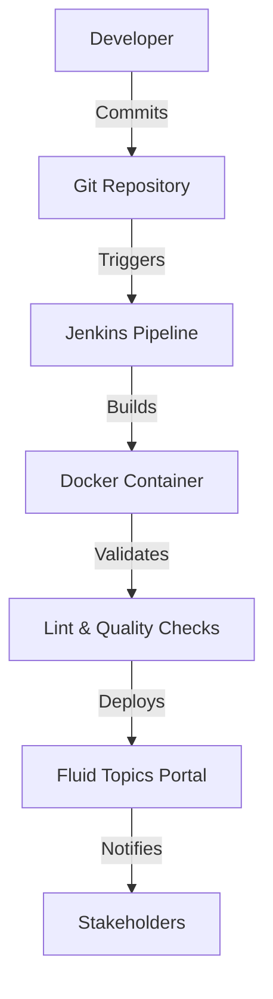

# DocsFlow Documentation Portal

Welcome to **DocsFlow** - your automated documentation pipeline solution!

## Overview

DocsFlow streamlines the entire documentation lifecycle from creation to deployment. Our CI/CD pipeline ensures your documentation is always up-to-date, validated, and accessible.

## Key Features

- 🚀 **Automated Pipeline**: Zero-touch deployment from commit to publish
- 🔍 **Quality Assurance**: Built-in linting and validation
- 🐳 **Containerized**: Consistent builds across environments
- 📊 **Monitoring**: Real-time deployment status and rollback capabilities

## Quick Navigation

- [Getting Started Guide](getting-started.md) - Set up your first pipeline
- [Style Guide](style-guide.md) - Documentation standards and best practices

## Architecture

## Getting Help

- Check our [troubleshooting guide](getting-started.md#troubleshooting)
- Review the [pipeline logs](http://your-jenkins-url/job/docsflow-pipeline/)
- Contact the DevOps team for infrastructure issues