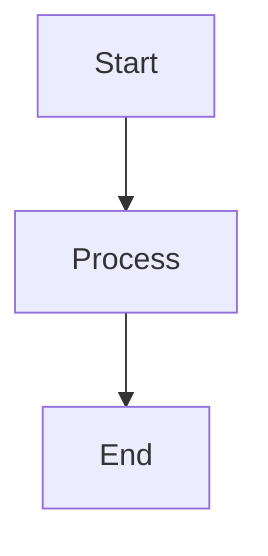

# Documentation Style Guide

This style guide ensures consistency and quality across all DocsFlow documentation.

## Writing Principles

### Clarity First
- Use simple, direct language
- Avoid jargon unless necessary
- Define technical terms when first introduced
- Structure information logically

### User-Focused
- Write for your audience's expertise level
- Include practical examples
- Provide actionable steps
- Anticipate common questions

## Document Structure

### Required Elements

Every document should include:

1. **Title** - Clear, descriptive H1 heading
2. **Overview** - Brief summary of the content
3. **Table of Contents** - For documents longer than 3 sections
4. **Prerequisites** - What users need before starting
5. **Main Content** - Structured with clear headings
6. **Next Steps** - What to do after reading

### Heading Hierarchy

```markdown
# H1 - Document Title (only one per document)
## H2 - Major Sections
### H3 - Subsections
#### H4 - Specific Topics (use sparingly)
```

## Formatting Standards

### Code Examples

Always specify the language for code blocks:

````markdown
```bash
git clone https://github.com/user/repo.git
```

```python
def hello_world():
    print("Hello, World!")
```
````

### File Paths

Use backticks for file and directory names:
- Correct: `docs/index.md`
- Incorrect: docs/index.md

### Commands

Distinguish between different types of commands:

```bash
# Terminal commands
docker build -t myapp .
```

```powershell
# PowerShell commands
Get-ChildItem -Path "C:\Projects"
```

### Links

Use descriptive link text:
- Good: [Jenkins Pipeline Documentation](https://jenkins.io/doc/book/pipeline/)
- Bad: [click here](https://jenkins.io/doc/book/pipeline/)

## Content Guidelines

### Lists

Use consistent formatting for lists:

**Unordered Lists:**
- Use hyphens (-) for bullet points
- Maintain consistent indentation
- Use parallel structure

**Ordered Lists:**
1. Use numbers for sequential steps
2. Start each item with a capital letter
3. End with periods if items are complete sentences

### Tables

Use tables for structured data:

| Feature | Status | Priority |
|---------|--------|----------|
| Auto-deployment | ✅ Complete | High |
| Rollback support | 🚧 In Progress | Medium |
| Multi-environment | 📋 Planned | Low |

### Admonitions

Use consistent styles for callouts:

```markdown
!!! note "Information"
    Additional context or helpful tips

!!! warning "Important"
    Critical information users must know

!!! danger "Caution"
    Potential risks or destructive actions
```

## Language and Tone

### Voice

- **Active voice**: "Deploy the application" not "The application should be deployed"
- **Present tense**: "The pipeline validates" not "The pipeline will validate"
- **Second person**: "You can configure" not "One can configure"

### Technical Accuracy

- Use precise technical terminology
- Verify all code examples work
- Keep version numbers current
- Test all provided links

### Inclusive Language

- Use gender-neutral language
- Avoid cultural assumptions
- Consider accessibility needs
- Use plain language when possible

## Visual Elements

### Screenshots

When including screenshots:
- Use consistent browser/OS appearance
- Highlight relevant areas with red boxes or arrows
- Include alt text for accessibility
- Keep images under 1MB when possible

### Diagrams

Prefer text-based diagrams when possible:



## Review Checklist

Before publishing, verify:

- [ ] Document follows the required structure
- [ ] All code examples are tested and working
- [ ] Links are functional and current
- [ ] Spelling and grammar are correct
- [ ] Headings follow hierarchy rules
- [ ] Content is accurate and up-to-date
- [ ] Screenshots include alt text
- [ ] File passes linting checks

## Tools and Automation

### Linting

All documentation is automatically checked for:
- Markdown syntax errors
- Spelling mistakes
- Broken links
- Style consistency

### Local Preview

Always preview your changes locally:

```bash
mkdocs serve
```

### Automated Checks

The pipeline runs these validations:
- `lint_docs.py` - Markdown and style checking
- `validate_yaml.py` - YAML frontmatter validation
- Link checking and spell checking

## Version Control

### Commit Messages

Use clear, descriptive commit messages:

```
docs: add troubleshooting section to getting started guide

- Added common error scenarios
- Included resolution steps
- Updated table of contents
```

### Branch Naming

Follow consistent naming:
- `docs/feature-name` - New documentation
- `docs/fix-issue-123` - Bug fixes
- `docs/update-api-reference` - Updates

## Publishing Workflow

1. **Draft** - Create initial content
2. **Review** - Self-review using checklist
3. **Test** - Verify all examples work
4. **Commit** - Push to feature branch
5. **Preview** - Review staging deployment
6. **Merge** - Merge to main branch
7. **Monitor** - Check production deployment

Remember: Good documentation is an investment in your users' success and your project's adoption.